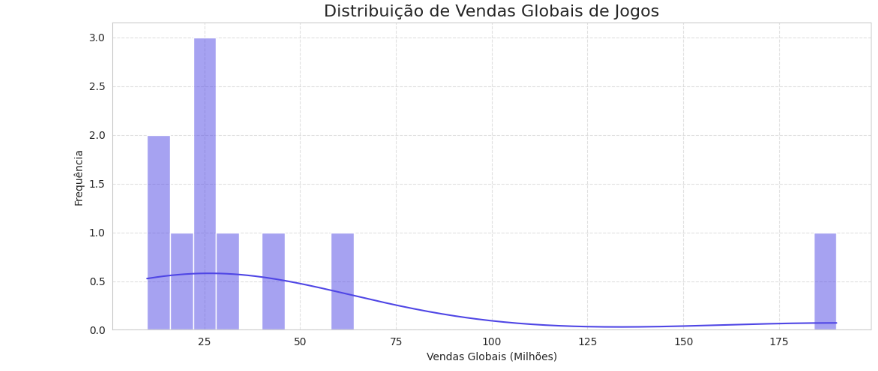

# Análise de Vendas de Jogos com Python 🎮📊

Este projeto tem como objetivo explorar e visualizar uma base de dados de vendas globais de jogos utilizando Python, Pandas, Seaborn e Matplotlib.

## 📁 Estrutura do Projeto

```
analise-dados-python/
├── Data/
│   └── vendas_jogos.csv
├── Notebooks/
│   └── analise-vendas-jogos.ipynb
├── Images/
│   └── grafico-1.png
    └── grafico-2.png
├── README.md
├── requirements.txt
```

## 📊 O que foi feito

- Leitura e inspeção da base de dados
- Verificação de dados ausentes
- Estatísticas descritivas
- Gráfico de distribuição de vendas globais
- Gráfico de barras com os 10 gêneros mais frequentes

## 🚀 Ferramentas utilizadas

- Python
- Pandas
- Seaborn
- Matplotlib
- Jupyter Notebook / Google Colab

## 📸 Exemplo de gráfico



## 📌 Como executar

1. Clone este repositório
2. Instale as dependências com:

```
pip install -r requirements.txt
```

3. Abra o notebook `notebooks/analise-vendas-jogos.ipynb` e execute as células
